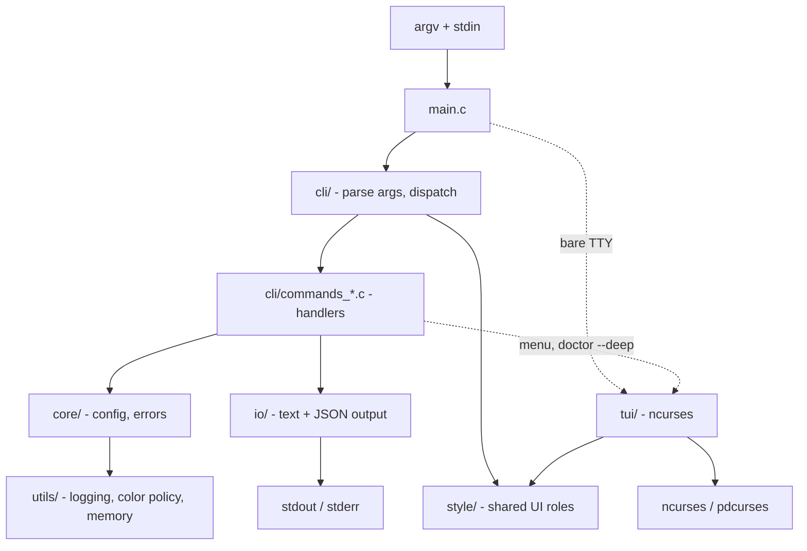

# Architecture Overview

A map of how Curspan is put together: the framework layer (theme → surface →
components), the reference app built on it, the real modules, how a command runs,
and where to add your own code.

- [The mental model](#the-mental-model)
- [The framework layer](#the-framework-layer)
- [Distribution: the registry and curspan add](#distribution-the-registry-and-curspan-add)
- [Module map](#module-map)
- [Request lifecycle](#request-lifecycle)
- [Build system](#build-system)
- [Platform differences](#platform-differences)
- [Security model](#security-model)
- [Where to add code](#where-to-add-code)

## The mental model

Curspan is two things in one repo: a **framework** (a themeable component catalog
that renders on either terminal front-end) and a **reference app** that uses it.

The framework is three layers — a [theme](THEMING.md) (design tokens → semantic
roles), a neutral [render surface](COMPONENTS.md#the-surface) with a CLI-stream
backend and a TUI-window backend, and a [component catalog](COMPONENTS.md) that
draws through the surface. The umbrella header `curspan.h` exposes all three. See
[The framework layer](#the-framework-layer).

The reference app is a small, layered C23 program. `main.c` parses arguments,
resolves configuration, selects the TUI, headless JSON, or a named CLI command,
and runs command handlers through one table. Handlers write text on TTYs or JSON
under pipes through one I/O layer and signal failure with a typed error code that
becomes the process exit status.

The interactive ncurses interface is a separate layer that compiles by default. Pass
`-Denable-tui=false` when you want a CLI/headless-only build with no curses
dependency.



## The framework layer

```
                         curspan.h  (umbrella header)
   theme (tokens->roles)        surface (neutral)            components
 ┌───────────────────┐   ┌─────────────────────────┐   ┌────────────────────┐
 │ design_tokens      │   │ cs_surface (interface)  │   │ cs_rule  cs_heading │
 │ ui_theme (roles)   │──▶│  ├ stream backend ──────┼──▶│ cs_badge cs_note    │
 │ cs_theme (public)  │   │  │   (CLI: SGR)          │   │ cs_keyvalue cs_list │
 │  named themes,     │   │  └ curses backend ───────┼──▶│ cs_table cs_progress│
 │  per-role override │   │      (TUI: WINDOW*)      │   │ cs_spinner …        │
 └───────────────────┘   └─────────────────────────┘   └────────────────────┘
          │                          │
          └──── shared resolver ─────┘   registry/registry.json + `curspan add`
```

- **Theme** (`src/style/`): the design-token → semantic-role pipeline, exposed as
  the public `cs_theme` API (named themes, per-role overrides, mode resolution).
  One shared resolver (`app_ui_color_resolve`) degrades a role to a concrete
  color for a terminal profile; both surface backends call it, so a role looks
  the same everywhere. See [THEMING.md](THEMING.md).
- **Surface** (`src/surface/`): the neutral `cs_surface_t` every component draws
  to. `surface.c` holds the public dispatch and the curses-free stream backend;
  `surface_curses.c` (compiled only under `ENABLE_TUI`) holds all ncurses
  contact, reached through an ops vtable — so a CLI-only or unit-test build never
  links a curses symbol. See [COMPONENTS.md](COMPONENTS.md#the-surface).
- **Components** (`src/components/`): self-contained `cs_<name>.h/.c` widgets with
  a borrowed-pointer props struct and a `cs_<name>_render(props, surface)` entry
  point. See [COMPONENTS.md](COMPONENTS.md).

The public framework namespace is `cs_`; the implementation keeps the existing
`app_`/`tui_` symbols, which stay back-compatible for the reference app and the
`tui-menu` contract. The whole framework layer compiles whenever either
front-end is enabled (the curses backend only under `-Denable-tui`), so every
build flag combination still links.

## Distribution: the registry and curspan add

Components are **open code** — you copy them into your project and own them, the
way ShadCN distributes UI components. The catalog is described by a
machine-readable manifest, [`registry/registry.json`](../registry/registry.json):
each entry lists a component's `files`, its `dependencies` on other entries, and
metadata. Foundations (`surface`, `theme`, `text-layout`, `color-math`,
`design-tokens`, `glyphs`) are entries too, so dependency closures resolve.

The `curspan` CLI (`tools/curspan/main.zig`, built with `zig build curspan`)
reads that manifest:

```bash
curspan list                 # the catalog, grouped by category
curspan info table           # a component's files + dependency closure
curspan add table --dest DIR # copy cs_table + its transitive deps into DIR
curspan check                # validate the registry (files exist, deps resolve, acyclic)
```

`add` copies the component **and its transitive dependency closure**, then prints
the exact `build.zig` source lines to add for the copied `.c` files. `zig build
registry` runs `curspan check`, and that check is wired into `zig build test`, so
the manifest can't drift from the source tree. The tooling lives outside the app
binary, so the `opencli.json` contract is untouched.

## Module map

Each directory under `src/` owns one concern. The functions below are representative entry points, not the full surface; read the matching header for the rest.

| Module | Files | Responsibility | Representative functions |
| --- | --- | --- | --- |
| `cli` | `args.c`, `help.c`, `commands.c`, `commands_*.c`, `opencli_contract.c` | Parse argv, apply global flags, find and dispatch commands, render help, expose the OpenCLI contract | `app_args_handle_immediate_exit()`, `app_commands()`, `app_command_find()`, `app_print_concise_help()` |
| `core` | `app_info.c`, `diagnostics.c`, `config.c`, `config_json.c`, `request_json.c`, `error.c`, `types.h` | Build/feature metadata, diagnostic checks, layered configuration, config/headless JSON readers, the flag table, and typed errors | `app_build_info()`, `app_feature_table()`, `app_diagnostics_collect()`, `app_config_create()`, `app_request_parse_json()`, `app_strerror()` |
| `io` | `input.c`, `output.c`, `terminal.c` | Read stdin/files; write human text and versioned JSON; answer basic curses-free terminal facts | `app_read_input_from_stdin()`, `app_output()`, `app_json_write_string()`, `app_terminal_is_interactive()` |
| `ui` | `action_item.c`, `text_layout.c` | Curses-free UI primitives. `text_layout.c` (text width/truncation/wrapping) is live and shared by the CLI and TUI renderers. `action_item.c` (selectable action descriptors) is a live shared seam: `app_actions_from_commands()` projects the CLI command table into curses-free descriptors, and the TUI's **Commands** screen (`tui/tui_app.c`) builds its menu rows from those descriptors via the adapter below — so this primitive is on the production path. | `app_text_width_utf8()`, `app_text_truncate_utf8_columns()`, `app_actions_from_commands()` |
| `style` | `design_tokens.c`, `ui_theme.c`, `color_math.c`, `cs_theme.c` | Curses-free visual primitives shared by both front-ends: raw RGB design tokens, semantic UI roles, accent parsing, RGB→ANSI degradation, and one shared color resolver. `cs_theme.c` is the public theming API (named themes, per-role override, mode resolution) over these roles. | `APP_DESIGN_PALETTE`, `app_ui_color_resolve()`, `cs_theme_default()`, `cs_theme_by_name()`, `cs_theme_set_role()` |
| `surface` | `surface.c`, `surface_curses.c` | The neutral `cs_surface` every component draws to: public dispatch + the curses-free stream (CLI/SGR) backend in `surface.c`; the ncurses (TUI) backend in `surface_curses.c`, behind an ops vtable and gated on `ENABLE_TUI`. | `cs_surface_stream_new()`, `cs_surface_curses_new()`, `cs_surface_set_role()`, `cs_surface_write()` |
| `components` | `cs_rule.c`, `cs_heading.c`, `cs_badge.c`, `cs_note.c`, `cs_keyvalue.c`, `cs_list.c`, `cs_table.c`, `cs_progress.c`, `cs_spinner.c`, `cs_glyphs.h` | The component catalog. Each is a self-contained widget with a borrowed-pointer props struct that renders through `cs_surface`, so the same call works on a CLI stream and a TUI window. | `cs_table_render()`, `cs_note_render()`, `cs_progress_render()`, `cs_heading_render()` |
| `tui` | `tui.c`, `tui_menu.c`, `tui_menu_adapter.c`, `tui_menu_model.c`, `tui_progress.c`, `tui_app.c` | ncurses lifecycle, modal menus, progress bars, and the demo showcase (compiled by default unless `-Denable-tui=false`). `tui_menu_adapter.c` converts each curses-free `app_action_item_t` into a `tui_menu_item_t`; the showcase's **Commands** screen uses it to render CLI command metadata as menu rows. TUI colors are realized from shared `style` roles through curses palette/pair fallbacks. | `tui_init()`, `tui_cleanup()`, `tui_show_menu()`, `tui_menu_item_from_action()`, `tui_progress_create()` |
| `utils` | `colors.c`, `logging.c`, `memory.c` | Cross-cutting helpers: color-policy env parsing, leveled logging, secret zeroing | `app_log_init()`, `app_color_env_force()`, `app_secret_zero()` |

The command table is the seam to extend. `commands.c` registers the built-in commands,
and each lives in its own file (`commands_basic.c` for `hello`/`echo`, plus
`commands_info.c`, `commands_doctor.c`, `commands_menu.c`, `commands_opencli.c`). See
[examples/adding-a-command.md](../examples/adding-a-command.md).

## Request lifecycle

1. `main()` initializes logging and creates an `app_config_t`.
2. The CLI layer reads argv. Immediate-exit options (`--help`, `--version`) are handled
   first by `app_args_handle_immediate_exit()`. Global flags (`--debug`, `--quiet`,
   `--verbose`, `--json`, `--plain`, `--no-color`, `--config`) update the config; the
   remaining tokens become the command name and its arguments.
3. Configuration is resolved by precedence: **CLI args > environment > config file > defaults**.
4. With no command, `main()` selects the front-end: bare TTY opens the TUI; bare
   non-TTY reads a request object with `app_request_parse_json()` and maps it onto
   the command table.
5. `app_command_find()` looks up the command. Its handler runs and writes output through `app_output()` / the `app_json_*` helpers.
6. On failure a handler returns an `app_error` value (see `core/error.c`). `app_strerror()` describes it, and the numeric code becomes the exit status. The public codes are listed in `opencli.json`.
7. Commands that need the terminal UI (`menu`, and `doctor --deep`) call `tui_init()` and always pair it with `tui_cleanup()`, including on interrupt.

The stable shape of this surface (commands, flags, exit codes, JSON envelopes) is documented in [CONTRACTS.md](CONTRACTS.md).

## Build system

`build.zig` compiles the C sources with Zig's bundled Clang. The base binary is the
file list in the `base_sources` array; the `tui_sources` are appended by default,
which also defines `ENABLE_TUI=1` and links `ncursesw` (or `pdcurses` on Windows).
Pass `-Denable-tui=false` to skip those sources. A separate `tui-menu-lib` step builds the reusable menu
primitive as a static library with installed headers.

The two front-ends are independent build axes: the shared UI primitives (text
layout, color math, design tokens, and semantic UI theme roles) compile whenever
*either* the TUI or the CLI styling layer is enabled, so every combination
links. A stripped `ReleaseSafe` binary
ranges from ~139 KB (full TUI + styling) down to a ~68 KB libc-only build with
both front-ends off; see the [footprint matrix](ZIG_PRIMER.md#binary-footprint).

For the build options, steps, and how to add a source file, see the [Zig Primer](ZIG_PRIMER.md).

## Platform differences

| Concern | Linux / macOS | Windows |
| --- | --- | --- |
| Terminal UI | ncurses (`ncursesw`) | pdcurses |
| Secret memory | `app_secret_zero()` helper (not wired by default) | `app_secret_zero()` helper (not wired by default) |
| Config path | `~/.config/myapp/config.json` | `%USERPROFILE%\AppData\Local\myapp\config.json` |
| Binary name | `myapp` | `myapp.exe` |

Cross-compilation is a `-Dtarget=` flag away because Zig ships every target's headers and libc; no second toolchain to install.

## Security model

The template's defenses are the ones actually wired into the code and CI, not compiler hardening flags. Those are left for you to opt into.

- **Secret-zeroing helper.** `src/utils/memory.h` exports `app_secret_zero()` for
  clearing sensitive buffers. The template ships it as a primitive but no production
  path calls it yet; invoke it where your code holds secrets. Memory locking
  (`mlock` / `VirtualLock`) is not wired in either.
- **Compiler warnings.** C sources compile with `-Wall -Wextra -std=c23`. `-Doptimize=` selects the optimization level; no Zig runtime is linked into the C-only binary.
- **Static analysis in CI.** GitHub Actions runs `clang-tidy` and `cppcheck` over the C sources on every change.
- **Supply chain in CI.** Gitleaks secret scanning, CodeQL, an OpenSSF Scorecard run, SBOM generation, and release gates are scaffolded in GitHub Actions.
  Keep third-party actions and downloaded tools pinned to immutable revisions in production projects.

Compiler-level hardening (`-fstack-protector-strong`, `-D_FORTIFY_SOURCE=2`, PIE/RELRO) is **not** enabled by default. If your threat model needs it, add the flags to `base_flags` in `build.zig`.

## Where to add code

| You want to… | Start here |
| --- | --- |
| Render a component | [COMPONENTS.md](COMPONENTS.md) — make a `cs_surface`, call `cs_<name>_render` |
| Add a component to your project | `curspan add <name>` (see [the registry section](#distribution-the-registry-and-curspan-add)) |
| Re-theme or override a role | [THEMING.md](THEMING.md) — `cs_theme_by_name` / `cs_theme_set_role` |
| Author a new component | copy an existing `src/components/cs_*.{c,h}`, then add it to `registry/registry.json` |
| Add a command | [examples/adding-a-command.md](../examples/adding-a-command.md), then register it in `src/cli/commands.c` |
| Add a config flag | `src/core/config.c` (the flag table) and `src/core/config_json.c` |
| Add a new exit code | `src/core/error.c`, then regenerate `opencli.json` (see [CONTRACTS.md](CONTRACTS.md)) |
| Build a TUI screen | [examples/custom-tui.md](../examples/custom-tui.md) and `src/tui/` |
| Add a source file to the build | the `base_sources` array in `build.zig` (see [ZIG_PRIMER.md](ZIG_PRIMER.md)) |
| Test any of the above | [TESTING.md](TESTING.md) |
